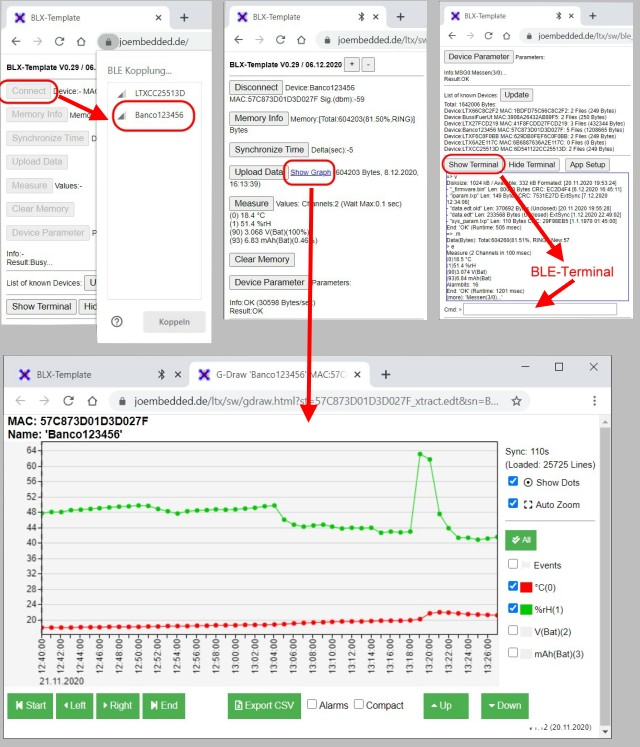
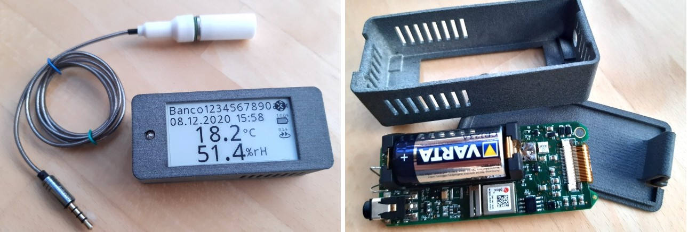

# LTX BLE: Using Web Bluetooth to access LTX Data Loggers #
** LTX BLE API **

__Web Bluetooth__ is an official __W3C API__, integrated in most modern Browsers (like Chrome, Edge, Opera, …) 
on Android and Windows. So it is now very easy to connect to Bluetooth devices 
with one single software with Desktops/Notebooks (Windows), as well as with Smartphones/Tablets (Android and Windows)! 
_(Unfortunately the Web Bluetooth API is still not available on Safari (iOS), but workarounds exists)._

It is even not necessary to install any native APPs! The complete software is nothing else, than a _„Simple Web page“_! Extremely convenient and safe!
This new technology is used to access the LTX Data Loggers via Bluetooth. 

These are 2 sample devices:

A simple LTX Climate Logger with E-Paper, internal and external Sensor and Bluetooth for the local communication.

An Ultra-low-power Tracker, based on the LTX platform. The tracker uses 2G and LTE-M(4G) to send data to the LTX Cloud and Bluetooth for local communication.

Data and setups are stored in the Browser’s Cache. Because LTX uses flexible data formats, it is even possible to use the same tools (like graphical viewers or CSV exports) 
as the LTX Server software! 

The LTX BLE software is written in pure Javascript and does not require any frameworks! The basic drivers communicate via callbacks and data structures.
The HTML/CSS-part is up to the user. Also it is a good idea to put everything in in the end in a PWA (Progressive Web App),
which can the really “run stand alone” and even without Internet connection!

This is only the demo, showing the basics of the LTX BLE drivers! 

To allow debugging, LTX BLE drivers support a console type terminal, that can be located into a DOM object.
These drivers also support sending firmware updates to the device!

Live demo: https://joembedded.de/ltx/ltx_ble_demo/ble_api/blk_sdk_template.html

---

## Changelog ##
- V1.01 08.12.2020 Initial
